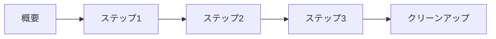

# ハンズオン名

このハンズオンでは、○○について学びます。

---

## このハンズオンで学べること

- 学習項目1
- 学習項目2
- 学習項目3

---

## 前提条件

このハンズオンを始める前に、以下の準備が必要です。

| 項目 | 要件 |
|------|------|
| AWS アカウント | 有効なアカウントが必要 |
| IAM 権限 | 管理者権限または必要な権限 |
| 所要時間 | 約 XX 分 |

---

## ハンズオンの流れ

1. **概要** - ハンズオンの全体像を理解
2. **ステップ1** - ○○の設定
3. **ステップ2** - ○○の構築
4. **ステップ3** - ○○の確認
5. **クリーンアップ** - リソースの削除

---

## 始める

準備ができたら、[概要](01_overview.md) に進んでください。

[:octicons-arrow-right-24: 概要へ進む](01_overview.md){ .md-button .md-button--primary }
